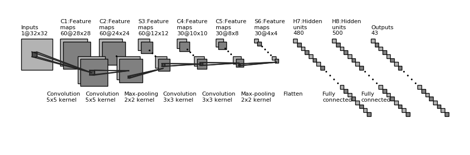
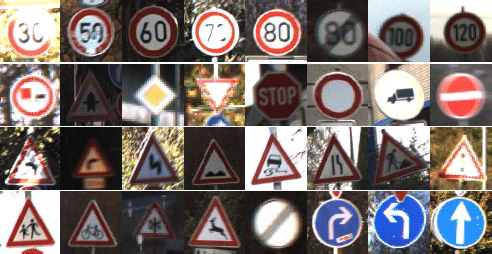
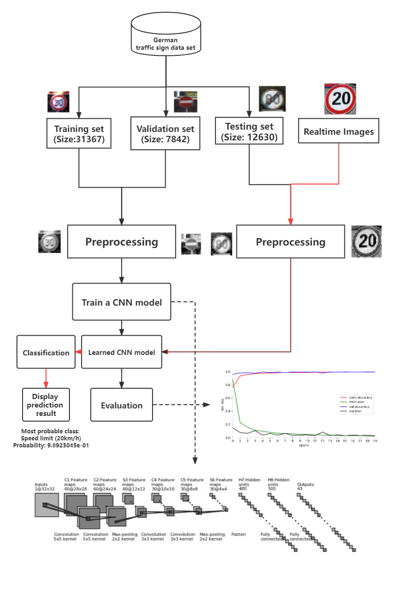

# Simple Improved LeNet-5 on GTSRB (Traffic Sign Classification)

## Declaration

This is the project for class Data Science Programming II.

There are `report` file, presentation `ppt` and `draft`, `jupyter notebook` file(s), `log` files, `model(HDF5)` files, and dataset examples in the repository.

## Reference

**Mainly based on the paper.**

Zaibi, Ameur & Anis, Ladgham & Sakly, Anis. (2021). *A Lightweight Model for Traffic Sign Classification Based on Enhanced LeNet-5 Network*. Journal of Sensors. 2021. 10.1155/2021/8870529.

The model conception map：

## Dataset

43 classes for Traffic Sign Classification

+ Information on : https://benchmark.ini.rub.de/gtsrb_dataset.html

+ Download on: https://sid.erda.dk/public/archives/daaeac0d7ce1152aea9b61d9f1e19370/published-archive.html (you can find it on the download section on the upper link)

I download those:

+ GTSRB_Final_Test_GT.zip (csv) (I unzip this file into the test images folder)
+ GTSRB_Final_Test_Images.zip (ppm+csv)
+ GTSRB_Final_Training_Images.zip (ppm+csv)

There is also a file called `signnames.csv`, which maps numbers into class names. I found it on kaggle.

# Project in One Figure

